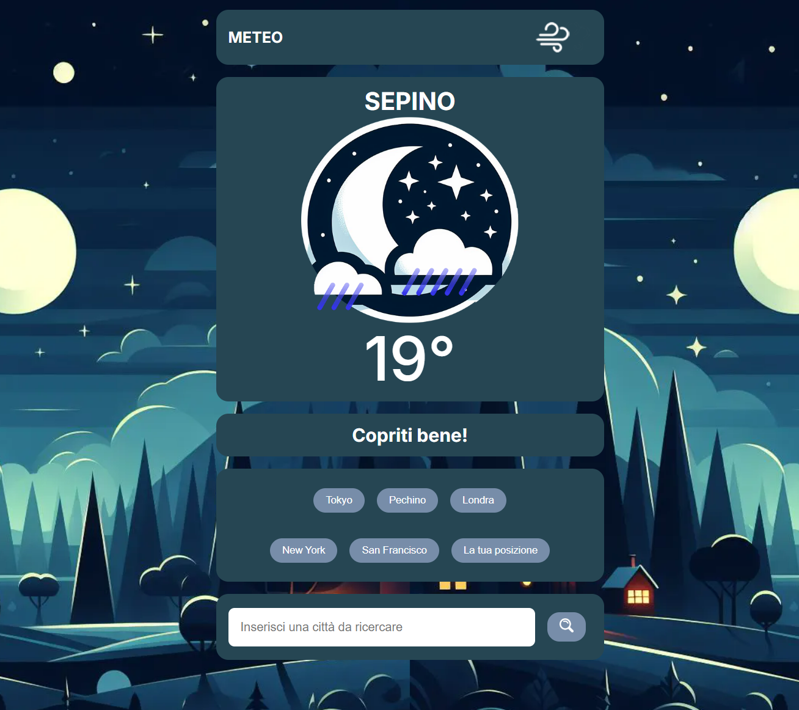
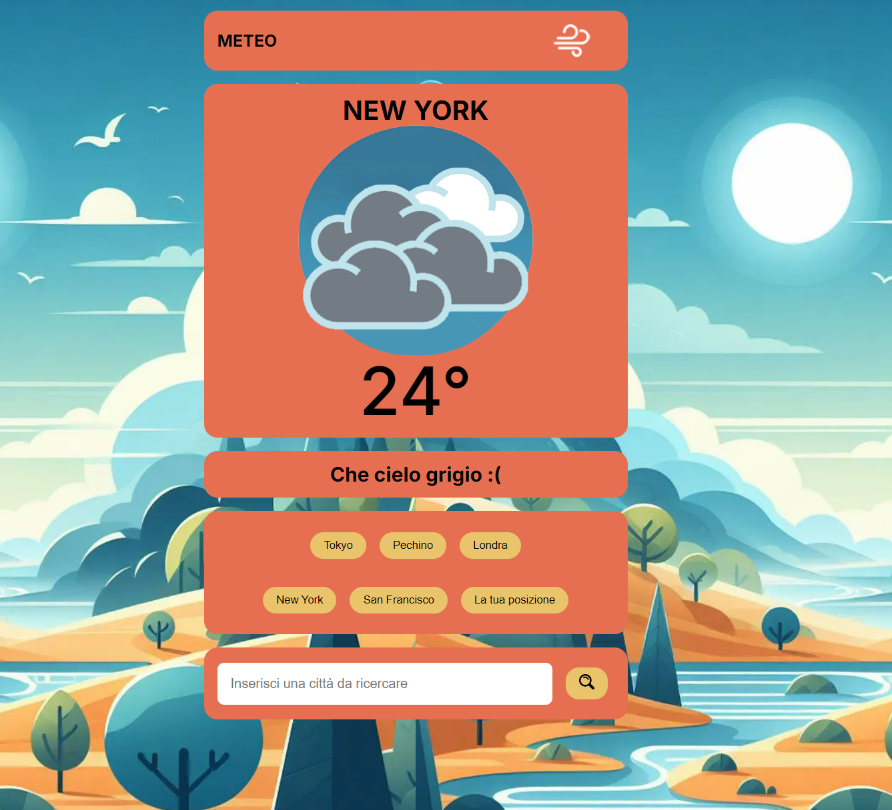

## Meteo WebAPP

## Semplice Web App che restituisce le previsioni metereologiche in tempo reale sfruttando una API esterna: OpenWeatherMap.

## E' possibile inserire una città da ricercare oppure utilizzare le funzioni di geolocalizzazione del proprio device (smartphone, tablet, pc previa )
## per ottenere in tempo reale le previsioni meteo del luogo in cui ci troviamo.

## La Web App inoltre restituisce un tema chiaro o notturno in base all'orario della città.

## Il link di netlify per vedere la web app in azione: https://capable-parfait-152de6.netlify.app/

## Demo

### 🌙 Dark Theme

### ☀️ Light Theme
